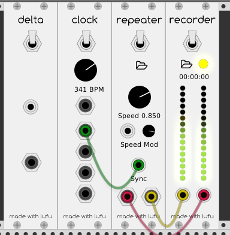

# lufu-modules
Assorted VCV Rack plugins

Currently builds against __Rack v0.5.1.__




## How to build

* Clone the repo into the Rack plugins directory.
```
git clone https://github.com/mlove-au/lufu-modules && cd lufu-modules
```

* Update submodules
```
git submodule update --init --recursive
```

* Make and run
```
make && make -C ../../ run
```


## Modules

### Clock

Simple master clock with mulitpler outputs. Top output is triggered once when switching from off to on, and the following four outputs are clock triggers with increasing multipliers (1x, 2x, 4x, 8x)

### Repeater

A very basic sample looper. Load a WAV or AIFF file using the file icon.

### Recorder

A WAV file recorder. Select the output file using the file icon. When the status light is green, toggle the record switch. Does not support changing sample rates during recording. 
 

### Delta

A utility to generate triggers when the incoming signal changes _direction_. Try modulating several LFOs, feeding the resulting signal into delta, and then using the output as a clock signal for some interesting rhythms.


